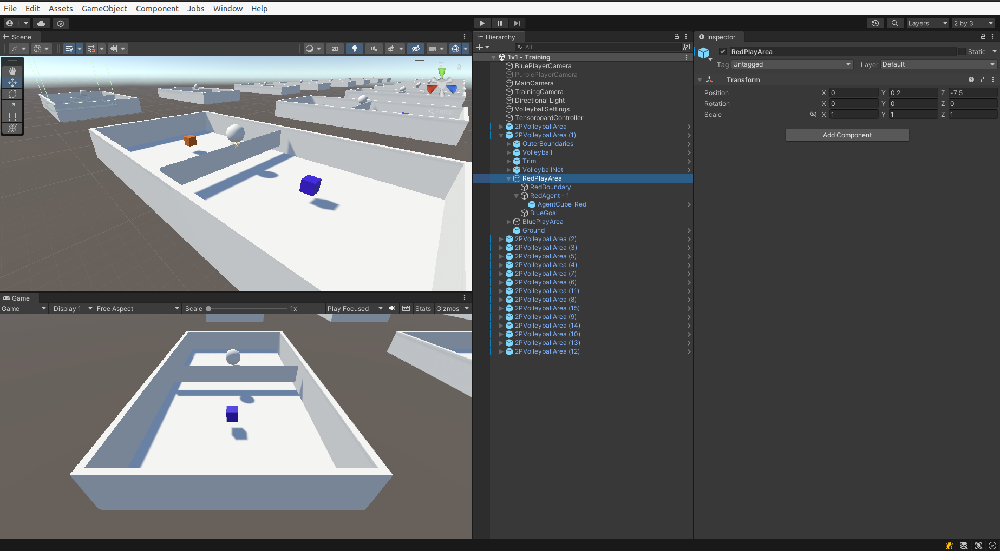
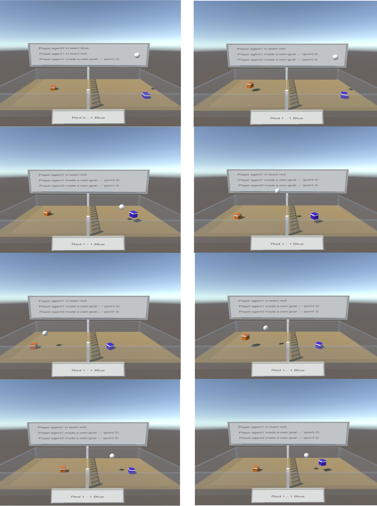

Unity Project for the project vollAIball.
The backend is [here](https://github.com/gianfrancodemarco/vollAIballKB).

This project explores the realm of applying artificial intelligence (AI) techniques to train autonomous agents at the game of volleyball. 
It consists of a Unity 3D environment, crafted on purpose, where agents are trained using the ML-Agents library and the Proximal Policy Optimization (PPO) algorithm. 
Another vital component of the project is the Prolog Knowledge Base, acting as a narrator that provides detailed insights into the game’s events.
These two main components are glued together by using a Python backend and rest APIs. 
This project allowed to explore the possibility of integrating different AI systems, using modern tech stacks and providing variegated features.

 

  
  
<i>The software architecture of the project</i>

 

## The vollAIball Environment
The goal of this project is to train autonomous agents
to play the game of vollAIball.
The environment has been created using Unity3D,
where also the rules of the game are coded.

The Unity environment communicates with a Knowledge Base implemented using SWI-Prolog through a
Python backend, which exposes APIs to store facts and
retrieve the commentary of the game.

The commentary is then printed in a screen placed on
the side of the field in the Unity scene.

The Unity environment consists of the field where the
game takes place, the agents and the ball. The field is
a complex environment, consisting of the terrain, the
walls, the net, and some invisible areas which are used
to trigger events.

 

  
  
<i>The unity project</i>

 

 

  
  
<i>A gameplay example</i>

 